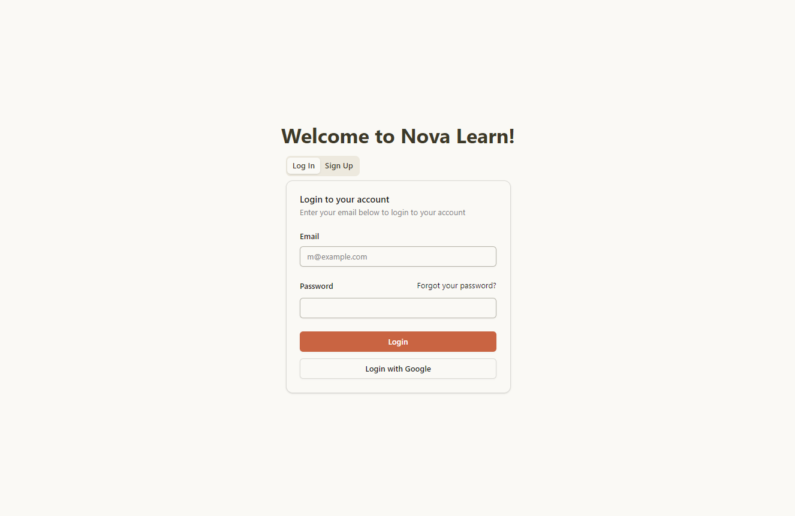
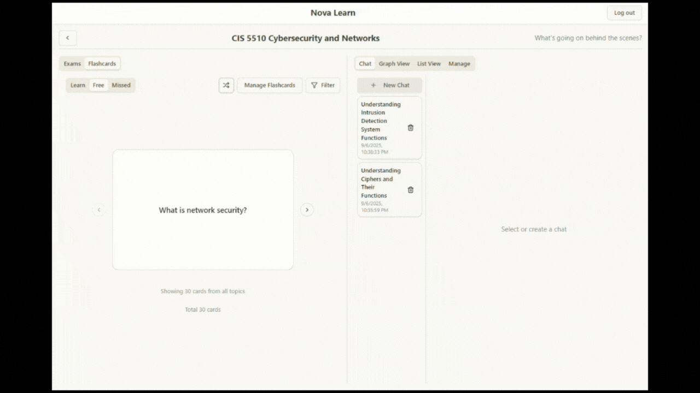

# Nova Learn
LLM powered learning platform.
Built with FastAPI, React, and PostgreSQL.

## Overview
- User authentication and profile management
- AI generated content maps
- AI generated flashcards and practice exams
- Spaced repetition learning system

## Tech Stack
- Backend: FastAPI, SQLAlchemy, PostgreSQL
- Frontend: ReactTS, Tailwind CSS
- AI: OpenRouter API
- Deployment: Docker, Docker Compose

## Features
### User Authentication

- Email/password/Google authentication using Firebase
- User profile management
- Authentication flow:
    - Frontend: Firebase handles user auth and returns ID token, sent to backend in all requests
    - Backend: FastAPI verifies ID token with Firebase Admin SDK. extracts user info, and creates/accesses user in PostgreSQL database
    - Database access: CRUD layer checks user ID from backend for all operations

### Project Creation

- User can input a subject, description, goals
- AI-assisted generation of topic list, prerequisites
- Graph visualization of content map

### Chat

- AI assistant to help with learning
- Chat about any topic, flashcard, or exam question

### Flashcards

- AI-generated flashcards for each topic
- Filter by topics, edit flashcards, view AI generated explanation
- Chat about any flashcard on the Chat tab
- **Free Mode**: review all flashcards, shuffle or by topic
- **Learn Mode**: spaced repetition system implementing SuperMemo2 Algo, suggests flashcards based on past performance
- **Missed Mode**: review frequently missed flashcards based on Exponentially Weighted Moving Average (EWMA) of past performance

### Practice Exams

- AI-generated practice exams by topic
- Filter by topics, take exam, view exam attempt history
- Edit scoring of each question
- Chat about any exam question on the Chat tab

## Run Locally
1. Clone the repository
2. Set up Firebase project and enable Authentication. Get the `serviceAccountKey.json` file and place in `backend/api`
3. Set up an OpenRouter API key. Free tier is sufficient.
4. Set up environment variables in a `.env` file. See `.env.example` for reference. 
    - DB_ variables can be set to whatever you like, the docker container will be initialized with those settings. 
    - VITE_BACKEND_URL should be set to `http://localhost:8000` if running locally. 
    - VITE_FIREBASE_ variables match those in `serviceAccountKey.json`
5. Make sure you have Docker installed and running
6. Run `docker-compose up --build` from the root directory